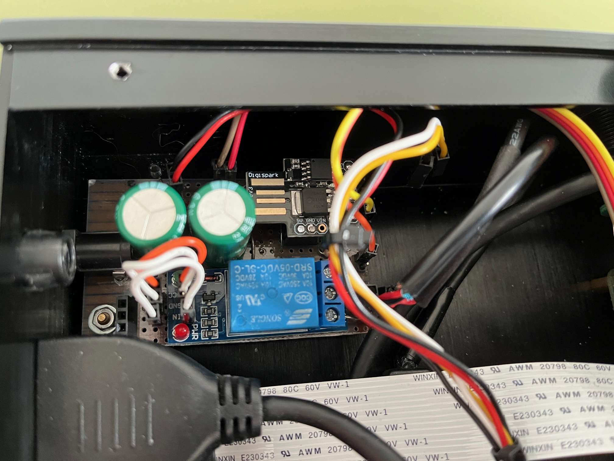

# ATTiny85 / Digispark - Raspberry Pi Power Control
When the power supply of my Rasptouch audio player failed, I decided to upgrade the power supply to a 5V lineair one. However, this also this also meant that I no longer could use the integrated power management module to control the Raspberry Pi. Although many versions already exist, I decided to make my own version. This version is based on a ATTiny85 / Digispark module which controls a 5V relay board. Communication with the Raspberry Pi is performed via a (software) serial port. It is also possible to connect a TM1637 based display.


# Pin assignment
The button pin is connected with ADC0 of the ATTiny85, which is also the reset pin. To prevent the microcontroller to reset, 
a voltage divider is used with a 4.7K resister connected with ground and a 1K resistor connected with VCC.
The switch point is around 930 on the scale between 0 and 1023.

The UART TX pin of the raspberry pi is directly connected with the RX pin on the ATTiny85.
The TX pin on the ATTiny85 is connected to the UART RX pin of the raspberry pi using a voltage divider.
 
PB1 and PB2 can be used to drive a TM1637 based display.
PB0 is used to trigger a 5V relay switch module.

## ATTiny85 pin assignment
```
1 ADC0 POWER BUTTON            (analog input)
3 PB4  SERIAL TX               (digital output)
2 PB3  SERIAL RX               (digital input)
7 PB2  DISPLAY CLOCK           (digital output)
6 PB1  DISPLAY_DIO / POWER LED (digital output)
5 PB0  RELAY SWITCH            (digital output)
```

```
                       ATTiny85
    Reset, ADC0, PB5  1   o    8  VCC 5 Volts
           ADC3, PB3  2        7  PB2, ADC1, I2C SCL, SPI SCK
           ADC2, PB4  3        6  PB1, PWM, SPI MISO
              Ground  4        5  PB0, PWM, I2C SDA, SPI MOSI
```

## Raspberry Pi pin assignment
```
UART TX         - RPi GPIO 14 / TXD / pin  8  - serial send
UART RX         - RPi GPIO 15 / RXD / pin 10  - serial receive
```

# OS integration
The scripts folder contains sample script files for integrating the power switch.
